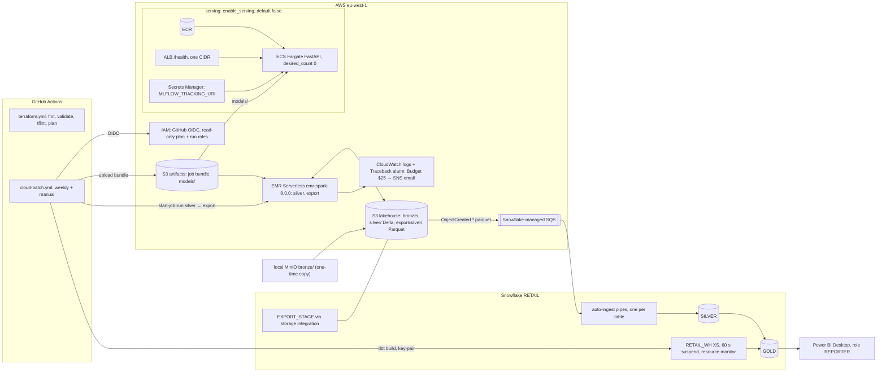

# Cloud architecture: AWS + Snowflake

The local Compose stack is the complete system. The cloud is a **deployable slice of the batch golden
path** plus this mapping of every other component. The slice is Terraform (`terraform/aws/`,
`terraform/snowflake/`): `fmt`, `validate` and `tflint` run in CI, and `apply` is a manual step
([runbook](runbooks/cloud.md)). Decisions: [ADR-0009](adr/0009-cloud-slice.md).

## Deployed slice

1. **Bronze.** The streaming layer isn't deployed (spec §15). Bronze Delta tables are copied once from
   the local MinIO bucket into `s3://<lakehouse>/bronze/` ([runbook](runbooks/cloud.md#4-seed-bronze)).
2. **Silver on EMR Serverless.** `lakehouse_spark/cloud/entrypoint.py silver --run-id <id>` runs the
   same silver jobs as local, with `LAKEHOUSE_URI=s3://<lakehouse>` and no MinIO settings. Release
   `emr-spark-8.0.0`: Spark 4.0.2 / Delta 4.0.0 / Python 3.11 (local: Spark 4.0.4 / Delta 4.0.1).
   Quality (Great Expectations) runs locally only, so `dq_results` has no cloud producer.
3. **Export.** `entrypoint.py export --run-id <id>` writes each silver table's current Delta
   snapshot as plain Parquet (`TIMESTAMP_MICROS`) to
   `s3://<lakehouse>/export/silver/<domain>/<table>/<run_id>/`, for example
   `export/silver/catalog/categories/<run_id>/`. Files are staged under `export/_staging/` and moved
   in with stable names (`part-NNNNN.parquet`, then `_SUCCESS`), so a retried run id reuses the same
   paths. Snowpipe can't follow a Delta log, which is why there's an export.
4. **Snowpipe.** One S3 event notification (prefix `export/silver/`, suffix `.parquet`) goes straight
   to the SQS queue Snowflake manages for the pipes. Each auto-ingest pipe runs `COPY INTO
   RETAIL.SILVER.<TABLE>` with `MATCH_BY_COLUMN_NAME` and records the file path in `_EXPORT_FILE`.
   Snowpipe's load history skips paths it has already loaded.
5. **Gold on Snowflake.** `dbt build --target snowflake` runs as `DBT_SERVICE` (key-pair auth, role
   `TRANSFORMER`). Every model lands in `GOLD` (`generate_schema_name` override). Every export run
   appends a full snapshot, so the Snowflake sources keep only the latest run per table, parsed from
   `_EXPORT_FILE`.
6. **BI.** Power BI connects to `RETAIL.GOLD` as `REPORTER`, which has read-only access to `GOLD`.
7. **Serving (optional).** `enable_serving = true` creates ECR, the ECS cluster and service, the ALB
   and the secret. The service starts at `desired_count = 0`. The task runs the same uvicorn launch as
   the Compose `serving` service and reads model artefacts from `s3://<artifacts>/models/`.

## Component mapping (local → AWS managed)

Costs are rough monthly **estimates** at list price, not quotes. The basis is 730 h/month, eu-west-1
where the pricing data has it, otherwise the example rate on that pricing page (noted). Sources are
listed [below](#pricing-sources). "Slice" rows are deployed by this repo; all other rows are
documented only.

| Local | AWS / managed | Status | Why | Monthly cost (estimate) |
|---|---|---|---|---|
| MinIO (S3 API) | S3: `landing`, `lakehouse`, `artifacts` (versioned, SSE-S3, public access blocked, 7-day lifecycle) | slice | Same S3 API, so the code only changes `LAKEHOUSE_URI` | < $1: $0.023/GB-month [S3] for a few GB |
| Delta Lake on MinIO | Delta Lake on S3 | slice | Same table format and same jobs | included in S3 |
| Spark batch: silver jobs | EMR Serverless `emr-spark-8.0.0`, auto-stop after 5 min idle, capped at 16 vCPU / 64 GB | slice | No cluster to manage; billed only while a job runs | ~$0.60 per run at the cap for 30 min ($0.052624/vCPU-h, $0.0057785/GB-h, EMR page example) → ~$2.60 for weekly runs |
| Great Expectations gates | Not deployed (GE needs Python ≥ 3.12 + pandas; EMR runs 3.11). In production: a container task before the export | local only | Keeps the EMR bundle dependency-free | — |
| dbt-duckdb (gold) + DuckDB | dbt-snowflake + Snowflake `RETAIL.GOLD`, warehouse XS, 60 s auto-suspend | slice | "S3 + Snowflake + dbt + Power BI" is the target stack (spec §14) | XS = 1 credit/h, billed per second after a 60 s minimum [SF-WH]; a ~10 min weekly build is ~0.7 credits/month; the $/credit depends on edition and region [SF-PRICE]; trial balance for 30 days [SF-TRIAL] |
| (none: duckdb reads Delta directly) | Snowpipe auto-ingest of the Parquet export | slice | Event-driven load and no warehouse to keep running | fixed credits per GB loaded [SF-PIPE]; the Olist silver set is small. Not capped by the resource monitor [SF-RM] |
| Airflow 3 (`silver_hourly`, `gold_daily`) | GitHub Actions `cloud-batch.yml` (slice); MWAA in production | slice / doc | See [MWAA in production](#mwaa-in-production) | Actions: free for public repos on standard runners; private repos use the plan's included minutes [GHA]; MWAA small environment $0.49/h → ~$358 [MWAA] |
| FastAPI serving (`retail-ml` image) | ECS Fargate 1 vCPU / 2 GB behind an ALB, image in ECR (slice, behind `enable_serving`); SageMaker real-time endpoint as the alternative | slice (off by default) | Same image and launch; scale to zero with `desired_count = 0` | Idle with `enable_serving = true`: ALB $0.0252/h [ELB] + 3 public IPv4 × $0.005/h [VPC] ≈ $29. One task 24×7 ≈ $36 + $3.65 IPv4 (Fargate page example rates) [FG]. SageMaker endpoint: ml.c5.xlarge $0.204/h (page example) ≈ $149 [SM] |
| `.env` secrets | Secrets Manager (serving config) | slice (with serving) | No secret value in Terraform state; set out of band | $0.40/secret [SECM] |
| Prometheus + Grafana | CloudWatch logs, metric filter and alarm (slice); Amazon Managed Grafana in production | slice / doc | Native to EMR and ECS logs | Logs $0.57/GB ingested [CW]; AMG $9 per editor, $5 per viewer [AMG] |
| (none) | AWS Budget $25/month, alerts at 50/80/100 % → SNS email | slice | Cost guard-rail as code | not costed |
| Postgres 16 (OLTP `olist`, pgvector image) | Aurora PostgreSQL Serverless v2 | doc | Managed Postgres with CDC (logical replication) | $0.12/ACU-h (page example) [AUR]: 0.5 ACU 24×7 ≈ $44, or storage only when it scales to 0 ACU |
| Redpanda | MSK Serverless (or Kinesis Data Streams) | doc | Same Kafka API, so producers and consumers don't change | $0.8625/cluster-h ≈ $630, plus $0.001725/partition-h [MSK] |
| Debezium on Kafka Connect | MSK Connect running the same Debezium connector (or DMS) | doc | Same connector config | $0.123/MCU-h: 1 MCU 24×7 ≈ $90 [MSK] |
| Spark Structured Streaming (bronze app, `spark-realtime`) | EMR Serverless streaming job | doc | Same jobs; out of scope for the slice (spec §15) | 4 vCPU / 16 GB 24×7 ≈ $221 (EMR page example rates) [EMR] |
| Python stream scorer, clickstream-sim, replayer | ECS Fargate services/tasks | doc | Same containers | ≈ $36 per 1 vCPU / 2 GB task 24×7 [FG] |
| Redis (Feast online store, candidates) | ElastiCache Serverless for Valkey | doc | Redis-compatible and serverless | $0.094/GB-h with a 100 MB minimum ≈ $7, plus ECPUs [EC] |
| Feast (registry, offline store, push server) | Feast with an S3 registry, Snowflake offline store and ElastiCache online store; push server on ECS | doc | One feature definition for batch and online stays | push server ≈ $36 as a Fargate task [FG] |
| MLflow 3 (tracking, registry, GenAI tracing) | SageMaker AI managed MLflow (Experiments / Model Registry) | doc | Same MLflow API and aliases | small tracking server $0.60/h (page example) ≈ $438 24×7, or ~$96 for 160 h [SM] |
| Evidently drift → retrain DAG | Scheduled container task (MWAA / Actions) | doc | Same code | per-run Fargate seconds [FG] |
| Ollama (Qwen2.5-7B, bge-m3) | Amazon Bedrock | doc | Managed models; no GPU to run | on-demand per token, no idle charge [BR] |
| LiteLLM proxy | LiteLLM on ECS routing to Bedrock, or Bedrock directly | doc | Agents keep the OpenAI-compatible route; the backend becomes one config line | ≈ $36 as a Fargate task [FG] |
| pgvector (RAG index) | Aurora PostgreSQL pgvector, or OpenSearch Serverless | doc | Same SQL and hybrid search with Aurora | Aurora as above [AUR]; OpenSearch Serverless $0.24/OCU-h (page example), ≈ $175 for 1 OCU 24×7 [OS] |
| Chainlit UI (both agents) | ECS Fargate behind the ALB | doc | Same container | ≈ $36 per task [FG], plus a shared ALB [ELB] |

**Slice totals (estimate).** Idle with serving off (the default): under $1/month on AWS (S3, logs,
state). Weekly batch runs: about $3–4/month on AWS plus under 1 Snowflake credit. Serving enabled
but idle: about +$29/month. One serving task 24×7: about +$40/month. The AWS Budget alerts at
$12.50, $20 and $25.

## MWAA in production

Locally, Airflow 3 schedules `silver_hourly` → `gold_daily` with dataset-aware triggers. The cloud
slice doesn't run Airflow. A small MWAA environment costs about $358/month before workers, roughly 14×
the whole $25 budget. Instead, `cloud-batch.yml` plays the orchestrator:
- **Triggers:** a weekly `schedule` plus `workflow_dispatch`, gated by the repo variable
  `CLOUD_ENABLED == 'true'`.
- **Steps:** assume the run role through OIDC → upload the job bundle to `artifacts` → EMR
  `start-job-run silver` and wait → `start-job-run export` and wait → Snowpipe loads the Parquet on
  S3 events → `dbt build --target snowflake` → a job summary with the run ids.

In production the same DAG shape moves to MWAA:
- `EmrServerlessStartJobRunOperator` (Amazon provider) for silver and export;
- a sensor or dataset on the export prefix;
- a dbt task on Snowflake;
- the Phase 3 alerting.

Snowpipe is already event-driven, so it doesn't need an orchestrator task.

## Pricing sources

Checked 2026-10-05. eu-west-1 values come from the pricing pages' regional price data.
- [EMR] https://aws.amazon.com/emr/pricing/: EMR Serverless worked example, $0.052624/vCPU-h and
  $0.0057785/GB-h.
- [FG] https://aws.amazon.com/fargate/pricing/: example $0.000011244/vCPU-s and $0.000001235/GB-s
  (= $0.0405/vCPU-h and $0.0044/GB-h).
- [ELB] https://aws.amazon.com/elasticloadbalancing/pricing/: eu-west-1 ALB $0.0252/h and
  $0.008/LCU-h.
- [VPC] https://aws.amazon.com/vpc/pricing/: eu-west-1 public IPv4 $0.005/h.
- [S3] https://aws.amazon.com/s3/pricing/: eu-west-1 Standard $0.023/GB-month (first 50 TB).
- [CW] https://aws.amazon.com/cloudwatch/pricing/: eu-west-1 logs ingestion $0.57/GB.
- [SECM] https://aws.amazon.com/secrets-manager/pricing/: $0.40 per secret per month.
- [MWAA] https://aws.amazon.com/managed-workflows-for-apache-airflow/pricing/: eu-west-1 small
  environment $0.49/h, additional small worker $0.055/h.
- [MSK] https://aws.amazon.com/msk/pricing/: eu-west-1 Serverless $0.8625/cluster-h and
  $0.001725/partition-h; MSK Connect $0.123/MCU-h.
- [EC] https://aws.amazon.com/elasticache/pricing/: eu-west-1 Serverless Valkey $0.094/GB-h; Valkey
  has a "90% lower minimum" than the 1 GB minimum.
- [SM] https://aws.amazon.com/sagemaker/ai/pricing/: examples, MLflow small $0.60/h and ml.c5.xlarge
  $0.204/h.
- [AUR] https://aws.amazon.com/rds/aurora/pricing/: example $0.12/ACU-h (Aurora Standard); capacity
  can scale to 0 ACU.
- [OS] https://aws.amazon.com/opensearch-service/pricing/: example $0.24/OCU-h.
- [AMG] https://aws.amazon.com/grafana/pricing/: $9 per editor, $5 per viewer.
- [BR] https://aws.amazon.com/bedrock/pricing/: on-demand per-token pricing.
- [SF-WH] https://docs.snowflake.com/en/user-guide/warehouses-overview: X-Small = 1 credit/h, per
  second with a 60 s minimum.
- [SF-PIPE] https://docs.snowflake.com/en/user-guide/data-load-snowpipe-billing: a fixed credit amount
  per GB.
- [SF-RM] https://docs.snowflake.com/en/user-guide/resource-monitors: resource monitors work for
  warehouses only, not for Snowpipe.
- [SF-PRICE] https://www.snowflake.com/en/pricing-options/: price per credit by edition.
- [SF-TRIAL] https://docs.snowflake.com/en/user-guide/admin-trial-account: 30 days or until the free
  balance is used up.
- [GHA] https://docs.github.com/en/billing/managing-billing-for-your-products/managing-billing-for-github-actions/about-billing-for-github-actions.
